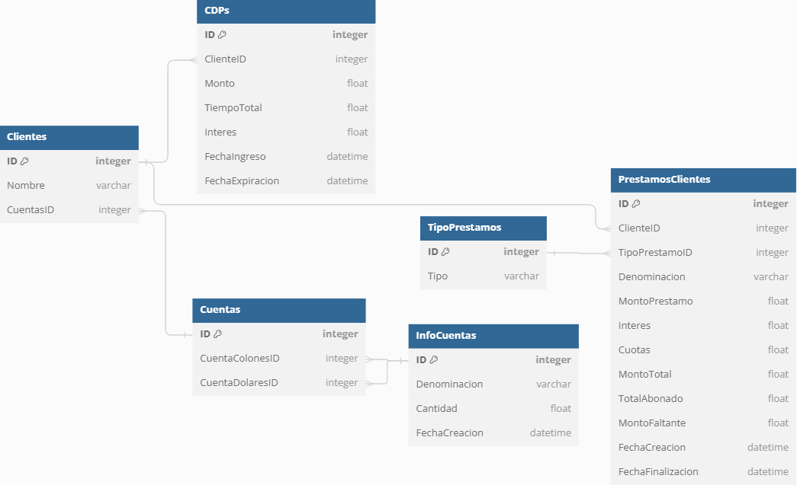

# Sistema de gestión bancaria

## 1. Resumen de requisitos

Cliente objetivo: Agentes que atienden clientes en un banco.

1.	Modalidad de operación: El sistema inicia con dos opciones; modalidad de atención a clientes, obtener información sobre préstamos.
2.	Información general: Opciones; 
    -	Préstamos personales, prendarios, hipotecarios. 
    -	Generar una tabla de pagos para la opción elegida, el monto del préstamo es ingresado por el usuario. 
    -	Obtener la tabla mediante valores personalizados de monto, cantidad de cuotas y la tasa de interés.
3.	Cuentas bancarias: Un cliente posee dos cuentas; colones y dólares.
4.	Operaciones disponibles: Operaciones; depósitos, retiros, transferencias, abonos a préstamos.
5.	Registro de transacciones: Registro detallado de todas las transacciones realizadas.
6.	Identificación de clientes: Único para cada cliente. Entre 0 y 999999999.
7.	Préstamos asociados: Préstamos asociados, en colones o dólares. Características; tasa de interés, periodo en meses y la cuota mensual.
8.	Reporte de préstamos: El cliente puede solicitar un reporte de sus préstamos. Se genera un archivo de texto que detalla las cuotas pagadas, desglosando el aporte al capital y los intereses abonados hasta el momento.
9.	Almacenamiento de la información: Uso de base de datos SQL.

## 2. Informacion teorica

### ¿Para que sirve un sistema de gestion bancaria?

Un sistema de gestion bancaria permite el manejo de la informacion y solicitudes por lo clientes de forma mas controlada y manteniendo un registro de todos los movimientos.

### ¿Que son un prestamo personal, prendario e hipotecario?

Un prestamo personal es un movimiento financiero en el cual el prestamista (el emisor) entrega una cantidad de dinero al prestatario (el receptor).

Un prestamo prendario es un movimiento igual al de un prestamo personal, pero con la condicion que el prestatario debe brindar uno o varios activos fisicos o financieros como garantia que equivalen a la cantidad del prestamo.

Un prestamo hipotecario es un movimiento igual al de un prestamo personal, pero orientado a la prestacion de dinero para la compra de un inmueble. Este movimiento requiere de la devolucion del dinero en pagos mensuales y con intereses.

### ¿Que son cuotas y tasas de interes?

Las cuotas son un monto periodico en el que una persona paga periodicamente para pagar una deuda, por ejemplo pagos mensuales de un prestamo hipotecario.

Las tasas de interes son un porcentaje de operaciones que se realizan con el dinero. Existen dos tipos; interes por deposito, interes por credito. La tasa de interes por deposito equivale al pago que recibe una persona que deposita el dinero en disposicion de otra persona o entidad, por ejemplo las cuentas de ahorros. La tasa de interes por credito equivale al monto que debe pagar una persona a otra persona o entidad por la prestacion de dinero, por ejemplo los prestamos hipotecarios.

### ¿Que es una cuenta que gestiona ahorros?

Una cuenta que gestiona ahorros es una cuenta que brinda una tasa de interes alta. La condicion para el uso de una cuenta de ahorros es el de ingresar un monto de dinero que no se puede retirar si se quiere obtener la tasa de interes. En caso de retirar el monto antes del periodo de tiempo definido, no se obtendra la tasa de interes.

### ¿Que es un certificado de deposito a plazo?

Un certificado de deposito a plazo es un tipo de inversion que permite invertir una cantidad de dinero por un periodo de tiempo para obtener un retorno respecto a una tasa de interes alta. Durante este periodo de tiempo no se puede retirar el monto. En caso de entraer el monto, no se obtendra la tasa de interes.

### ¿Que es un deposito, retiro, transferencia y abonos?

Un deposito es un movimiento financiero en el que se envia dinero fisico a una cuenta bancaria.

Un retiro es un movimiento financiero en el que se extraer dinero fisico de una cuenta bancaria.

Una transferencia es un movimiento financiero en el que envia dinero de una cuenta bancaria a otra.

Los abonos es el dinero que se envia como parte de un pago por un bien o servicio.

### ¿Que es una transaccion?

Una transaccion es el flujo financiero reflecado como la creacion, transformacion, intercambio, transferencia o extincion de un valor economico.

### ¿Que es un reporte de prestamos? ¿Que es el aporte al capital y los intereses abonados?

Un reporte de prestamos o historiual crediticio es un listado de todos los prestamos y abonos a prestamos de un cliente.

El aporte al capital es el abono que se realiza en un prestamo para la reduccion de la deuda.

Los intereses abonados es el abono que se realiza en un prestamo para la reduccion de la tasa de interes generada de la deuda.

## 3. Arquitectura

## 4. Esquema de base de datos

Para el esquema de la base de datos se utiliza un esquema de cinco tablas. La primera tabla llamada 'Clientes' se utilizara para almacenar el ID unico de cada cliente, el nombre y el ID de las cuentas de la tabla 'Cuentas'.

La tabla 'Cuentas' posee un ID identificador unico de la tabla y dos columnas de ID's. Una de las dos columnas es el ID de la cuenta en colones y la otra columna es la cuenta en dolares. Estos datos pueden llegar a ser NULL debido a que un cliente puede tener solo una cuenta en colones o solo una cuenta en dolares.

Los ID's de las cuentas en colones y dolares hacen referencia a la tabla 'InfoCuenta' que posee una columna con la denominacion, ya sea 'Colones' o 'Dolares', la cantidad de dinero en la cuenta y la fecha de creacion de la cuenta.

Por otra parte, tambien se posee una tabla para los CDPs, en el que poseen un ID unico y hacen referencia a la tabla 'Clientes' por medio de la columna 'ClienteID'. Ademas, se posee el monto de dinero que se ingresa al CDP, el tiempo total que se planea ingresar el dinero (3 meses, 6 meses, etc), el interes que se va a obtener, la fecha de creacion del CDP y la fecha de expiracion del mismo.

Para el tema de los prestamos, al igual que los CDPs, se posee una tabla 'PrestamosClientes' que por medio de la columna 'ClienteID' va a hacer referencia al ID de la tabla 'Clientes' para determinar de cual cliente es el prestamo, un cliente puede tener varios prestamos. Ademas, se posee una columna 'TipoPrestamoID' que se relaciona con la tabla 'TipoPrestamos', que este va a poseer los tipos Personal, Prendario e Hipotecario. En la tabla 'PrestamosClientes' tambien se posee la denominacion (ya sea 'Colones' o 'Dolares'), el monto del prestamo, el interes que se debe pagar del prestamo, la cantidad en cuotas mensuales, el monto total tomando en consideracion el interes, el total abonado y el monto faltante.